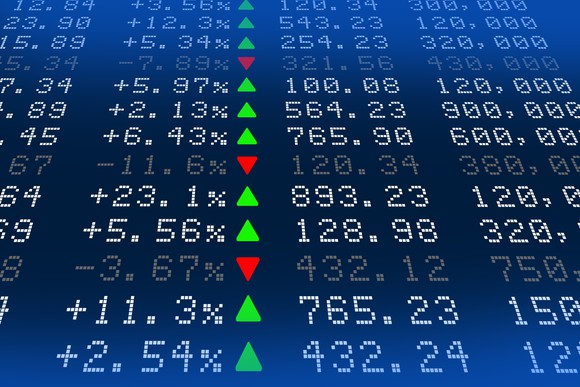
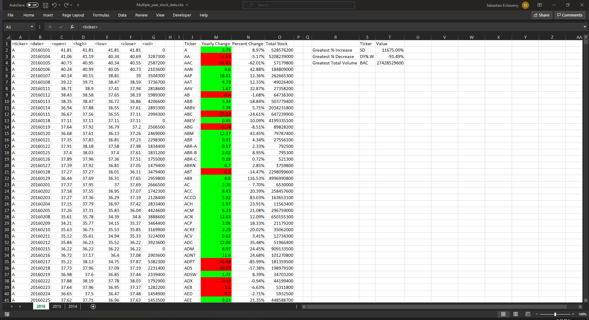
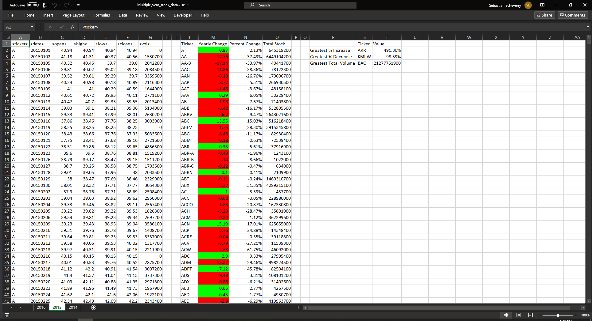
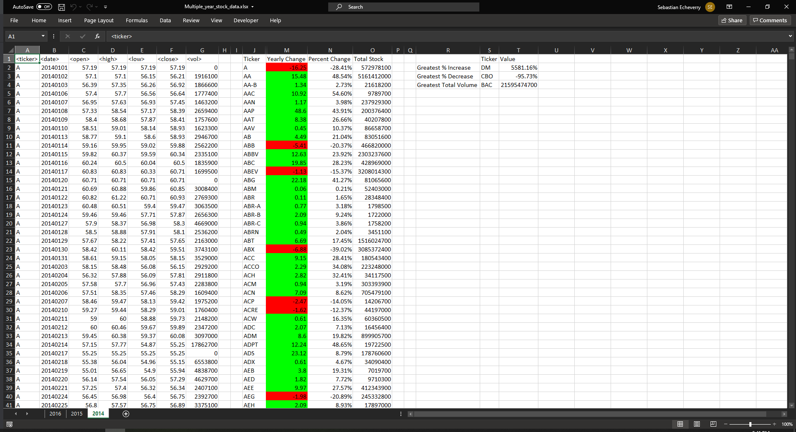

# Sebastian's VBA Challenge - The VBA of Wall Street

Hello! This is a demo project where I experimented with some scripts in VBA. Below are the goals I intend to achieve.

[VBA Script](Resources/VBAScripts.vbs) - The VBA scripts.

### Stock market analyst

## Instructions

* Create a script that will loop through all the stocks for one year and output the following information.

  * The ticker symbol.

  * Yearly change from opening price at the beginning of a given year to the closing price at the end of that year.

  * The percent change from opening price at the beginning of a given year to the closing price at the end of that year.

  * The total stock volume of the stock.

  * You should also have conditional formatting that will highlight positive change in green and negative change in red.

### Check It Out!

